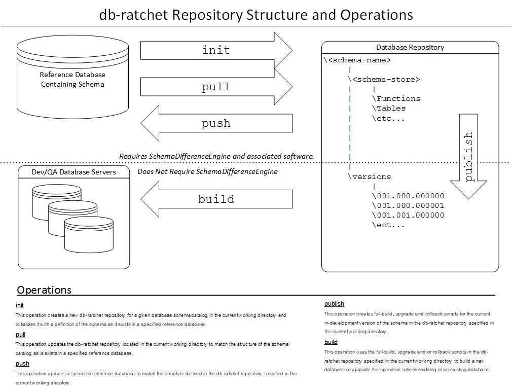

#What is db-ratchet?
db-ratchet is a tool to manage database compositions through the use of small incremental versions (individual clicks of a ratchet). This 
tool handles both the schema that defines a databases structure and behaviour as well as *control data* that the system requires
to be present in the database for application to function properly.

#Usage
db-ratchet manages a *repository-like* set of directories and files that make up the sources necessary to manage 
a database. db-ratchet uses a command pattern that users of Mercurial or Git will be familiar with. All db-ratchet
commands expect to be run form the root of a *repository* directory. Running `ratchet help` will print a list of 
currently commands supported by db-ratchet.

##Getting db-ratchet
Releases of db-ratchet can be found on [Bintray](https://bintray.com/commercehub-oss/apps/db-ratchet)

To install, simply unpack the zip file containing the release you want and make sure **&lt;install-root&gt;/db-ratchet/bin** 
is added to your path.

##Schema Management
Schema authoring support in db-ratchet is supported by use of a SchemaDifferenceEngine. A SchemaDifferenceEngine handles comparing databases
and file store representations of databases to produce version upgrade scripts. Currently db-ratchet has a single SchemaDifferenceEngine
implementation based on [Redgate SQlCompare](http://www.red-gate.com/products/sql-development/sql-compare/). There are near term plans to add
another implementation based on XML representation of schema objects that will not require commercial 3rd party software.

*The following diagram illustrates how schema management operations interact with the the database repository.*

Builds of database schema changes are handled by [Flyway DB](http://flywaydb.org/).

	
##Data Management
db-ratchet has 2 operations to support data migrations: **capture** and **migrate**. These operations manage *data packages* in an all or nothing fashion,
meaning there is no support for doing partial or row level migration of data. A **data package** is defined as one or more tables that need to be migrated 
as an atomic unit. 

This form of data migration support is intended for *control data* whose life cycle is tied to that of application development and whose migrations to a 
database happen in connection with a deployment of software and schema changes. Data packages are stored in the data directory of a database repository
and are configured in /data/data-packages.xml. Please see the comments in the template data-packages.xml in your database repository for instructions
on configuring data packages.

Data is stored in the data/packages directory and is based on the [DB Unit](http://dbunit.sourceforge.net/) XML format.

Data migrations leverage temp tables ans *SQL MERGE* statements to minimize the work that is done inside of the boundaries of a database transaction. With
this in mind we should be able to perform migrations for modest datasets without the need to shut down the system reading form the database. The migration
of a database package will succeed or fail atomically, so the possibility of leaving behind an inconsistent dataset is eliminated.

The choice to use *SQL MERGE* statements was based on this tool initially being developed for management of SQL Server databases only. Future plans for this
project include developing an alternate data migration implementation for other database platforms.

#Development
db-ratchet is written in Groovy and deploys with the groovy-all jar for version 2.1.7 of Groovy. Because this dependency is managed in the build script and 
the application is deployed with the groovy runtime, there is no dependency on a specific Groovy version being installed. In fact a Groovy installation is
not required to build and run db-ratchet. The Developer/User just needs a Java runtime 1.5 or higher.

##Building db-ratchet
db-ratchet's build is scripted in [Gradle](http://www.gradle.org/) 1.9 and includes a gradle wrapper. This build script uses Gradle plugin support for 
generating project files for both Eclipse and IntelliJ. This build script also includes the *Application Plugin* from Gradle. Run `gradlew installApp` 
to install your test copy locally between builds.

##Code Quality and Testing
The build script for db-ratchet runs the [CodeNarc](http://www.gradle.org/docs/current/userguide/codenarc_plugin.html) plugin for Gradle. CodeNarc is a static
analysis tool for Groovy. A rule set specific to the db-ratchet project is configured in config/codenarc/codenarc.xml of this Mercurial repository. The build 
is configured to fail the build for any rule violations. Please keep this code clean.

The build script for db-ratchet runs Cobertura to capture code coverage data. We use an open source 
[Cobertura Plugin](https://github.com/stevesaliman/gradle-cobertura-plugin). To capture code coverage data run the **cobertura** task in gradle. Do to an issue with
the current version of this plugin, cobertura will print a stacktrace to the console during instrumentation claiming that it can't load several classes in the project.
Despite this noise in the console, instrumentation will complete successfully and a code coverage report will be generated. For now, these stack traces can be ignored.

---
*Interested in working with Markdown? Get started with this Chrome extension for viewing .md files: [Markdown Preview](https://chrome.google.com/webstore/detail/markdown-preview/jmchmkecamhbiokiopfpnfgbidieafmd)*