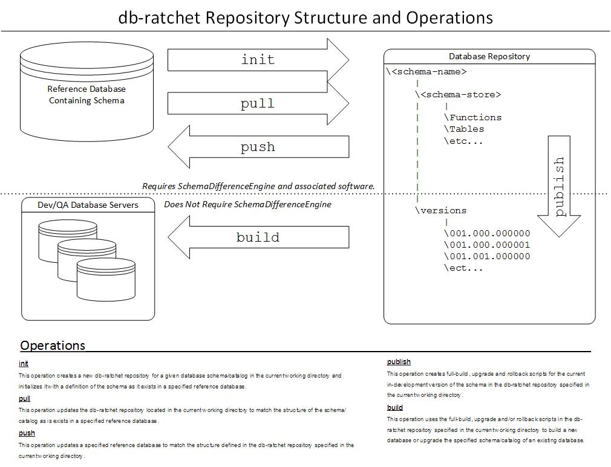

#db-ratchet User's Guide

##Schema Management
Schema authoring support in db-ratchet is supported by use of a SchemaDifferenceEngine. A SchemaDifferenceEngine handles comparing databases
and file store representations of databases to produce version upgrade scripts. Currently db-ratchet has a single SchemaDifferenceEngine
implementation based on [Redgate SQlCompare](http://www.red-gate.com/products/sql-development/sql-compare/). There are near term plans to add
another implementation based on XML representation of schema objects that will not require commercial 3rd party software.

*The following diagram illustrates how schema management operations interact with the the database repository.*

Builds of database schema changes are handled by [Flyway DB](http://flywaydb.org/).

##Data Management
db-ratchet has 2 operations to support data migrations: **capture** and **migrate**. These operations manage *data packages* in an all or nothing fashion,
meaning there is no support for doing partial or row level migration of data. A **data package** is defined as one or more tables that need to be migrated 
as an atomic unit. 

This form of data migration support is intended for *control data* whose life cycle is tied to that of application development and whose migrations to a 
database happen in connection with a deployment of software and schema changes. Data packages are stored in the data directory of a database repository
and are configured in /data/data-packages.xml. Please see the comments in the template data-packages.xml in your database repository for instructions
on configuring data packages.

Data is stored in the data/packages directory and is based on the [DB Unit](http://dbunit.sourceforge.net/) XML format.

Data migrations leverage temp tables and *SQL MERGE* statements to minimize the work that is done inside of the boundaries of a database transaction. With
this in mind we should be able to perform migrations for modest datasets without the need to shut down the system reading from the database. The migration
of a database package will succeed or fail atomically, so the possibility of leaving behind an inconsistent dataset is eliminated.

The choice to use *SQL MERGE* statements was based on this tool initially being developed for management of SQL Server databases only. Future plans for this
project include developing an alternate data migration implementation for other database platforms.

---
*Interested in working with Markdown? Get started with this Chrome extension for viewing .md files: [Markdown Preview](https://chrome.google.com/webstore/detail/markdown-preview/jmchmkecamhbiokiopfpnfgbidieafmd)*
